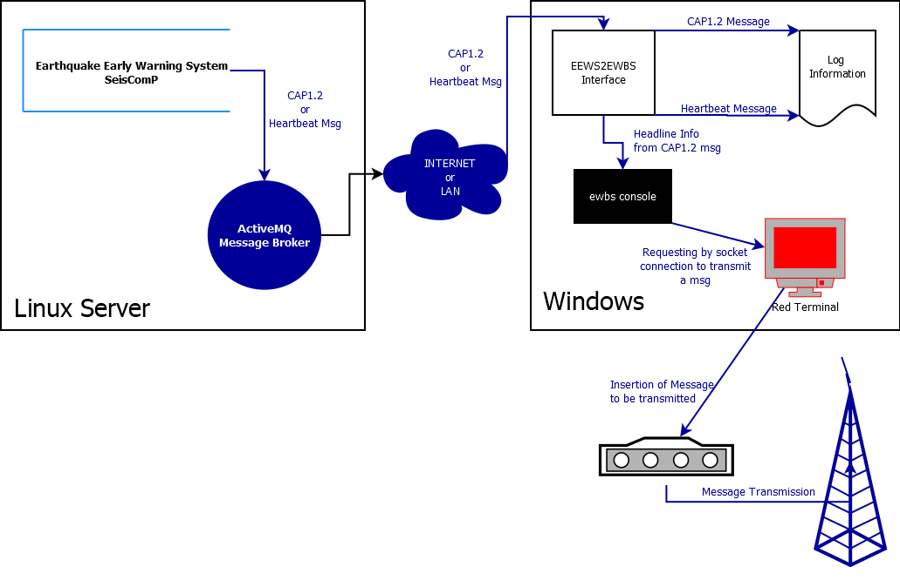
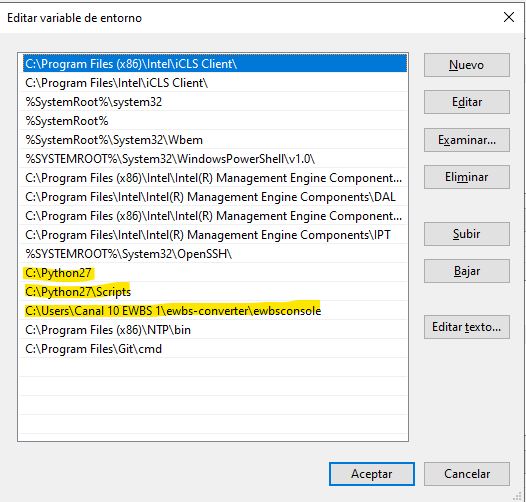

# EEWS - EWBS Interface
This is the interface of the Earthquake Early Warning System (EEWS) to Emergency Warning Broadcast System (EWBS) which has as a main goal to diseminate Common Alert Protocol (CAP version 1.2) XML messages which are created in the EEWS side in order to insert and transmit the alert messages through the Digital TV.



## Background
The EEWS-EWBS Interface (just called interface) is a python application running on Windows OS and that is listening to the next messages:

1. CAP1.2 
2. Heartbeat

Those messages are in XML format and created and sent from EEWS. For CAP1.2 XML message the format is according to the documentation presented on its website [CAP1.2](http://docs.oasis-open.org/emergency/cap/v1.2/CAP-v1.2.html  "CAP1.2"), whereas for the heartbeats is just a simple XML preformated message which contains the date and time on which the heartbeat message was sent from EEWS side. __The heartbeat is sent every 5 seconds from EEWS__.

### EEWS Messages
EEWS is basically a Seismological Computational System which runs different applications to process seismic data from seismic stations in near real-time. Among all the application are the Early Warning ones that are:
1. [Virtual Seismologist](http://www.seismo.ethz.ch/en/research-and-teaching/products-software/EEW/Virtual-Seismologist/ "Virtual Seismologist").
2. [FinDer](http://www.seismo.ethz.ch/en/research-and-teaching/products-software/EEW/finite-fault-rupture-detector-finder/ "FinDer")

#### First - Regionalized filter on EEWS

EEWS has a notification application named __sceewlog__ which is listening to EQ automatic solutions with their magnitude values (MVS or Mfd). This application, once it gets this information, then it inmediately filters the information using the next parameters:

1. Magnitude threshold
2. Likelihood threshold (quality of the solution)
3. min and max depth of the Earthquake
4. max time to send an alert
5. polygon check

in order to whether send or not an alert (if AMQ notification is set for email there is no filter evaluation).

#### Second - Creation  of CAP1.2 Message

If an EQ automatic solution meets all the parameters that are evaluated through the Regionalized filter, then __sceewlog__ (or one alias of this) creates the alert message. sceewlog uses SC3 XML event information to create CAP1.2 through stylesheet converter. Once the CAP1.2 alert messsage is ready, it sends out the alert message to AMQ message broker. The message broker receives the msg and inmediately sends out the CAP1.2 msg to all connected clients. One of these clients is the EEWS2EWBS interface and this diseminates the information in order to start a transmission.

#### Third - Heartbeat Message 
In order to find out if the system to report automatic solutions is alive, the sceewlog application sends out a heartbeat every 5 seconds. This message can be received for any connected client to the message broker in order to find out whether this is running or not.

#### Fourth - Logging
Both CAP1.2 XML alert messages and Heartbeats are stored in daily files within the log folder. From this log information an application can create for example the delta times for the different stages: automatic solution delay, INTERNET or LAN delay and insertion and transmission delay.

## Installation and Setup

In order to start the process of installing and configuring the eews2ewbs interface is necessary to clone the project:

    cd %userprofile%`
    git clone https://gitlab.seismo.ethz.ch/SED-EEW/ewbs-converter.git .

This will create a folder name _ewbs-converter_ which is in the home folder for the user who has the session open and ran the commands above.

### Folder Structure

The cloned project in its root folder contains three subfolders named:

1. dashboard
2. **eews2ewbs**
3. ewbsconsole

The second one (in bold) is the interface for which the setup and configuration is described in the present manual. The folder structure of the eews2ewbs interface is:

- eews2ewbs  
 - lib
 - log
 - img

Aside from the folders there are: templates files, the main python script that starts the interface, the list of contacts to whom the errors are reported and the configuration file. So basically the next list of files are on the root folder:

1. stompy2ewbs.py
2. stompy2ewbs.cfg
3. template files (heartbeat, red terminal and other tmpl files)
4. contacts.txt

## Requirements
The next programs are needed to run the interface:
1. Python 2 or 3
2. stompy (python 2.7) or stomp (python 3)

Many libraries are imported in order for the interface to run and most of them are part of Python package. Nevertheless, if for some reason any of them is not installed then proceed to install using _pip_.

## Enviroment variables

Two executable files must be on the Enviroment Variables of the Windows OS. These are:

1. ewbsconsole
2. python

The python executable file is generally at:

`c:\Python27\`

`%userprofile%\ewbs-converter\ewbsconsole\`

where **%userprofile%** is the main folder for the user (similar than $HOME in Linux). It must be replaced accordingly.

An example can be seen below for El Salvador (highlighted with yellow):



Doing this setting it will be possible to run Python and ewbsconsole from the command line of Windows called symbol system (CMD).

## configuration file

The configuration file for the interface is called stompy2ewbs.cfg which must be at the root folder:

    %userprofile%\ewbs-converter\eews2ewbs\

Since each datacenter has its own configuration values then there is no one stompy2ewbs.cfg in the git repository. However, there is one example config file which is named _config_example.cfg_ from which it is possible to find out which are the needed variables and using this information it can be possible to create a new stompy2ewbs.cfg.
The format of this config file is the well-known [_INI format for Python_](https://docs.python.org/3/library/configparser.html) where there are sections and comments start with #.
So, based on the concept of sections, there are 6 sections listed below:

1. EWBS-CONSOLE
2. AMQ-CONNECTION
3. ALERT-MESSAGE
4. LOGGING
5. EMAIL-REPORT
6. TESTING

Each section contains its own key-value pairs. 
### EWBS-CONSOLE

The section is for providing the IP address or hostname where the red terminal is running through the next key-value:

    ewbsconsolehost = localhost

In most of the cases the red terminal is running in the same computer where the interface runs, so in this case the value should be set as _localhost_.

Another parameter is how long in seconds the message will be alive on transmission:

    msgtime = 20

### AMQ-CONNECTION

This is for establishing a connection between AMQ message broker which generally runs at the seismic datacenter and the client which runs the interface.

    host = 190.151.176.***
    port = 61618
    user = admin
    password = pass
    topic = ewbs
    typeConnection = receiver

### ALERT-MESSAGE
In this section there are some important key-value:

    capsmsg = True
    staticmsg = False
    msg = Prueba de Alerta de Terremoto emitida por MARN
    language = es-US
    magDiff = 0.5

The _capsmsg_ key is for enabling or disabling (through a boolean value) to use or not the header information from CAP1.2 alert message. This is currently enable since the header information contains relevant and compacted information about the EQ (Magnitude, nearest city and country name).In case that the user does not want to use the header information from the CAP1.2 message, then it can be set this to false and it has to be enabled the _staticmsg_ (true). Since an static message will be presented, then it is also needed the string text that will be presented through the _msg_ key. It can be set any string without quotes.
The CAP1.2 alert message contains two elements in both Spanish and English and collecting the header information can be in any of them. For this purpose and having enabled _capsmsg_ to true then it corresponds to set the _language_ properly as es-US (Spanish US) or en-US (English US).
For the last key-value pair which is _magDiff_ it is necessary to understand what happens whenever EQ information is reported through activeMQ in CAP1.2 format. First, once an EQ is located and estimated its magnitude for the firt time, the CAP1.2 message is created and sent out through the message broker. There will be more updated alert messages as new data is processed and added to the solution. This update can happen every second since Virtual Seismologist Early Warning Algorithms are measuring and quantifying the magnitude every second, so new CAP1.2 alert messages are created with the updated information. It might happen that the magnitude can change and it is needed to update the message that is being transmitted. Thus, the _magDiff_ parameter is frequently measured and compared so that when the current transmitted message has a magnitude lower in _magDiff_ times then the interface inmediately stops the current transmission and starts a new one with the update magnitude.

### LOGGING

In order to log information the next key-value pairs must be set:

    hblog = False
    evtlog = True
    loghbstdout = false
    jsonlog = True
    countryName = El Salvador

For the first key _hblog_ the value is a boolean in order to enable or disable saving the XML heartbeat messages into a log file. This can be very verbose and generally it is disable but in case it is needed to log this info into the log file then it must be set to true.

For the _evtlog_ key is something similar than the hblog which is enabling or disabling saving the CAP1.2 alert message in text format within the log file. 

The _loghbstdout_ key is for logging the XML heartbeat message into the terminal where the eews2ewbs interface runs. This might be something for debugging purpose and it is recommended not enabling when this is on production since the overwhelming amount of text on the terminal can hide the most important information.

The _jsonlog_ key is to enable to save information about the event is it is highly recommended to leave it as true since the program that creates the dashboard uses the information stored in the well-known format json.

The _countryName_ is a key for identify the country in which the interface is running and mainly for identify the log information. Set this as formal as possible, this mean write properly the country's name (case sensitive).

### EMAIL-REPORT

During the period of running the interface for testing purposes it has been identified a group of common errors:

1. Heartbeat - Not receiving in the interface
2. Red Terminal - Not running the GUI
3. Transmission - Errors while starting the transmission
4. Unknown -  Errors which are provided through Python Try/Except pair

These errors can be reported through email and this section can be set up properly using the right information:

    emailReport = true
    emailSender = ewbs.errores@outlook.com 
    emailUser = ewbs.errores@outlook.com
    emailPassword = password
    smtp = smtp-mail.outlook.com
    smtpPort = 587

The first key is the _emailReport_ which is set true or false. If this is true then it is mandatory provide information which is valid for the next key-value pairs.

### TESTING

For testing purposes there is section with one key-value pair. This is _dryrun_ which is set by a boolean value to enable or disable the option to test receiving the CAP1.2 Message, parse it but NOT transmitting through the Red Terminal.

    dryrun = false

## Automatic Tasks

There are two main task that has been automated through basic Batch Scripts in Windows; the first one is automatic starting of Red Terminal and running the stompy2ewbs.py script. The second one is automatically parse the log information and compress the information to finally upload or push into gitlab repo for the especific country's data.

### Automatic Starting of Red Terminal and Interface

It is well-known that Windows OS can update its OS automatically without any confirmation and then this restarts the computer. Once this might happen for the mentioned reason or any other different one then it is necessary to start the red terminal and interface automatically. The below lines are part of the script which can automatically do the task of starting the mentioned applications. As long as the main folder of the application is on %userprofile% (which is home folder for the user) then no need to edit the next lines. In addition to the python script, the Red Terminal is first one to be started. Make sure to set the right path to the executable file of this application (first and second line in the script below).

```batch
REM Starting the Red Terminal
REM going to the folder that contains Tanabiki Apps
cd "C:\Program Files (x86)\TANABIKI\SetupEwbs\"
REM starting the GUI
start EwbsInserterTerm.exe &
REM sleeping for a minute in order to wait for the app to be
REM totally loaded 
timeout /t 60
REM going to the USER folder
cd %userprofile%
REM going to the right path that contains the stompy2ewbs.py script
cd ewbs-converter\eews2ewbs\
REM Running the script in the term and leaving open 
cmd /c C:\Python27\python.exe stompy2ewbs.py
```

This script must be put into the shell startup which is open through the next commands: `WindowsKey+r` and this will open a small GUI dialog on which it has to be typed: `shell:startup` and once this is executed it will show up a folder on which the previous script must be.

To test and if this is the first time that the script will run, then it is just a matter of restarting Windows and see that both the red terminal as well as the python script are open and running. 

### Automatic Uploading of log information for dashboard

The logged information of the interface is generally, for each country, at:

`%userprofile%\ewbs-converter\eews2ewbs\log\`

In this log folder there must be a folder whose name is the Country name and this will contain a set of folders in the format: YYYY/MM/DD/ and within the very last one (DD) there will be some files that contains log information.
In order to parse the information, created compressed files by different time of periods and finally upload this information into the gitlab repository there is a batch script that is automatically executed through "Task Scheduler" of Windows.
First, the script to do this task is right below (an example script for El Salvador):

```batch
echo on
REM Heading to the dashboard project
cd %userprofile%
cd ewbs-converter\dashboard\
REM running the updater script
python updater.py
cd ..
REM pulling before adding and committing
git pull
git add dashboard\pickledata\*ElSalvador*
git commit -m "El Salvador data update"
git push origin master
```

This script must be anywhere but currently this is on the Desktop one on each windows computer of each country.

Second, there must be a scheduled task through the Task Scheduler of Windows where this script is called every specific times during a day. In order to schedule a task for the purpose of running the above script it can be followed the next tutorial: [How to schedule a windows task to repeat every day within a time range?](https://superuser.com/questions/345319/how-to-schedule-a-windows-task-to-repeat-every-day-within-a-time-range)
