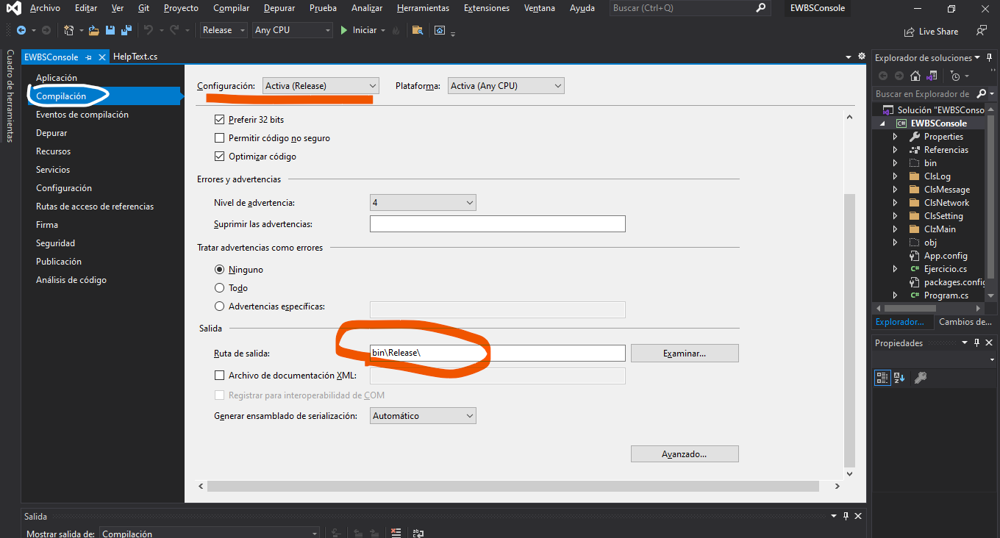

# EWBS Console - A command line program for Windows 10
The ewbsconsole program is a command line tool to communicate to the EWBS Red Terminal in order to send and stop messages to be inserted and transmitted through the Digital TV. In addition to that, this tool also connects and check the connection to specific terminal (generally called Server).
This tool is on the environmental varaibles of each EWBS country node of the EWARNICA project in order to be used by the eews2ewbs interface (a python script) to start and stop inserting and transmission of EQ alert messages.

## Compiling
In order to compile it is necessary to install Visual Studio. There is a free version and that is good enough to compile the project called ewbsconsole. 
1. Download the project through this command:
`git clone https://gitlab.seismo.ethz.ch/SED-EEW/ewbs-converter.git .`

2. go to `ewbs-converter/ewbsconsole/sourceCode`
3. Open the project once there is a Visual Studio (VS) IDE installed just double click on the file `EWBSconsole.sln`
4. Within the VS IDE, on the left-side vertical menu Click on Compiling and select what the type of compiling (release or debug) and other important options.

 

5. after setting up then it is just a matter to go to `compile -> compile solution`

6. finally, within the EWBSconsole folder there is a one called bin. If the release option was selected then the whole compile project will be at `bin/release`, whereas if debug option was selected then the compiled project will be at `bin/debug`

7. All the compiled files are important and those has to be in the same folder where the executable called `ewbsconsole.exe` is.

## Environment variables
In each country node the ewbsconsole is on the root of the next folder:
    %userprofile%\ewbs-converter\ewbsconsole\

and in order to run this command line program it is necessary to set the folder on the environment variables. Please, follow the next tutorial:
[Add to the PATH on Windows 10](https://www.architectryan.com/2018/03/17/add-to-the-path-on-windows-10/)

## Running - some examples
In order to use this command line to send and alert it is mandatory to know where the Red Terminal GUI is running (IP or hostname). Generally, this is on the same computer where the ewbsconsole is executed.

### Send and Stop an Alert MSG
In order to send and alert it is provided an example:

    ewbsconsole send -i localhost -a 258 -m "Hello World" -t 5

The message "Hello World" will be inserted and transmitted for 5 seconds.

In order to stop an ongoing transmission it is provided one example:
    
    ewbsconsole STOP -i localhost

